# Tempo Receipt Checker

Paste a transaction hash from **Tempo Moderato testnet** and get a plain-English payment receipt: who paid whom,
in which stablecoin, what the memo says, and which token covered the network fee. Paste several hashes at once to
reconcile a batch of payments, print a receipt as a PDF, or just watch the live block indicator to see the data is
real.

🔗 **Live app:** _published on GitHub Pages — see repository "About" link_
🔗 **Try it now:** open `docs/index.html?tx=0x413b6983673912c1e6e70b33387451298b18e38741457dffbffcc4c31d8f1107`

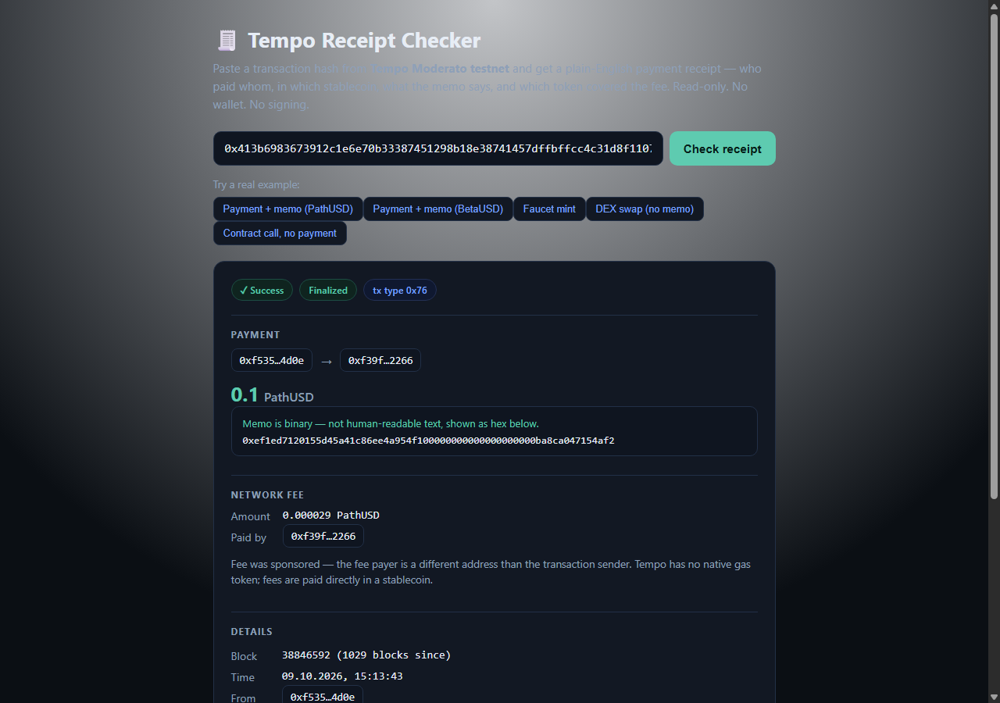

## Why this exists

Tempo is a payments-first L1 (incubated by Stripe and Paradigm) built for stablecoin settlement at enterprise
scale. Two things make it unlike every other EVM chain:

1. **No native gas token.** Fees are paid directly in a stablecoin (PathUSD, AlphaUSD, BetaUSD, ThetaUSD, …), and
   the fee payer can be a different address than the sender — a merchant can sponsor the receiver's gas.
2. **Built-in payment memos.** TIP-20 tokens (Tempo's ERC-20 extension) support `transferWithMemo`, which attaches
   a 32-byte memo to the transfer as part of the `TransferWithMemo` event — a native invoice/order ID, on-chain,
   without a side database.

A block explorer shows you raw logs. This tool reads the same data and turns it into the thing a merchant, a
marketplace, or their accountant actually wants: **"did this specific payment arrive, for how much, referencing
which invoice, and who paid the fee?"**

## Who it's for

A merchant or marketplace accepting stablecoin payments on Tempo (think a DoorDash-style platform), or their
customer/accountant, who has a transaction hash and needs a verifiable, human-readable receipt instead of a
screenshot of a block explorer.

## How it works

1. Paste a tx hash (or open a `?tx=0x...` link a merchant sent you). Paste several hashes separated by commas (or
   open `?tx=hash1,hash2,...`) to check a whole batch of payments in one page.
2. The page calls the official public RPC (`rpc.moderato.tempo.xyz`) directly from your browser:
   `eth_getTransactionByHash`, `eth_getTransactionReceipt`, `eth_getBlockByNumber("finalized")`.
3. It decodes the receipt's logs:
   - finds the `TransferWithMemo` event (if any) and shows the amount, token, sender, recipient and memo
     (attempted as text, always shown as hex);
   - finds the fee transfer (a plain `Transfer` to Tempo's fee-collector address, in `receipt.feeToken`) and shows
     the fee amount, token and who actually paid it;
   - if there's no recognized stablecoin transfer (e.g. a DEX order or a plain contract call), it says so plainly
     instead of pretending there was a payment.
4. Unknown TIP-20 tokens are looked up live via `symbol()`/`decimals()` — nothing is hardcoded beyond the five
   tokens confirmed live on Moderato (see below), and anything else is labeled "unverified token".
5. When you check more than one hash, a **batch summary** at the top adds up what actually arrived per token and
   what fees were paid per token (mint/faucet transfers are excluded from the totals) — useful for a merchant
   reconciling a day's payments, each possibly in a different stablecoin and with a different fee token.
   - A **recipient filter** field narrows the list down to just the transactions that paid a specific address — so
     a merchant can pick out *their own* payments from a batch of hashes that also include other people's, and the
     totals recompute for that filter. It's a free-text input with a dropdown of addresses seen in this batch, but
     you can also paste or type **any** address directly — useful when the batch doesn't yet contain a payment to
     the merchant you're checking for, and you just want to confirm there isn't one.
   - A **"Net after fees"** badge per token subtracts fees paid in that same token from what was received in it —
     the number a bookkeeper actually wants, not two separate lines they have to subtract by hand. If a fee was
     paid in a token nothing was received in, that's called out separately instead of being silently ignored.
   - A **sort** dropdown reorders the visible cards (default / amount high→low / amount low→high / block
     newest→oldest) without refetching anything.
   - **Export CSV** downloads exactly what's currently visible (respecting the filter and sort) as
     `hash, from, to, token, amount, net_after_fees, memo` — one row per payment, ready to paste into a spreadsheet
     for bookkeeping. `net_after_fees` applies the same math as the "Net after fees" badge to that row: the fee is
     subtracted only when it was paid in that row's own token, and only once per transaction, so the bookkeeper
     gets the same number in the sheet as on screen without re-deriving it.
6. Each receipt has a **"Print / save as PDF"** button; the page switches to a plain, white, one-receipt-per-page
   layout with a QR code pointing back at that exact `?tx=` link, so a merchant can hand a customer a paper or PDF
   proof of payment that anyone can re-verify by scanning it.
7. A small **live indicator** in the header polls `eth_blockNumber` every ~8 seconds and shows the current block
   height, so it's obvious this is a live page reading the chain right now, not a cached screenshot.
8. Every receipt card has an optional **"watch confirmations update live"** checkbox — switch it on and the card
   subscribes to the same block poll, showing the confirmation count since that transaction's block tick up in
   real time, right next to the payment, instead of only in the header.

No wallet connect, no signing, no backend, no API key for any of it — a static page calling a public JSON-RPC
endpoint that sends `Access-Control-Allow-Origin: *` (verified live). The QR code image is generated by the free,
keyless `api.qrserver.com` image endpoint from a receipt's own shareable URL (no transaction data beyond what's
already in the link); if that call fails, the QR box just quietly hides itself — the receipt itself works either way.

## Data sources

- RPC: `https://rpc.moderato.tempo.xyz` (chain id `42431`, confirmed via `eth_chainId`)
- Explorer links: `https://explore.testnet.tempo.xyz/tx/{hash}` and `/address/{address}` (Blockscout-based)
- Token registry, event signatures and the fee-collector address below were all derived by directly reading
  thousands of real logs on Moderato — not from secondary sources:

| Token | Address | Decimals |
|---|---|---|
| PathUSD | `0x20c0000000000000000000000000000000000000` | 6 |
| AlphaUSD | `0x20c0000000000000000000000000000000000001` | 6 |
| BetaUSD | `0x20c0000000000000000000000000000000000002` | 6 |
| ThetaUSD | `0x20c0000000000000000000000000000000000003` | 6 |
| OUSD (OpenUSD) | `0x20c0000000000000000000006a37da5c996874be` | 6 |

- `TransferWithMemo(address,address,uint256,bytes32)` — topic0 `0x57bc7354aa85aed339e000bccffabbc529466af35f0772c8f8ee1145927de7f0`
- Fee collector address: `0xfeec000000000000000000000000000000000000`
- Every Tempo receipt carries `feeToken` and `feePayer` fields regardless of transaction type (`0x0`/`0x2` legacy or
  `0x76` Tempo-native sponsored calls) — confirmed on multiple live receipts.

## Running locally

No build step. Open `docs/index.html` directly in a browser, or serve the `docs/` folder with any static file
server:

```
npx serve docs
```

## Honest limitations

- No address history / activity feed — each entry in a batch is still an independent single-transaction lookup,
  just shown together; there's no way to discover which hashes belong to a given address.
- Memo is shown as hex always; a readable-text guess is shown only when every byte is printable ASCII. Most memos
  observed on testnet today are opaque test bytes, not text — that's normal, not a bug (see the BetaUSD example
  below for a real readable one).
- Cannot verify TIP-403 transfer-policy details specifically — a failed transaction is shown as "Failed" without
  guessing why it reverted.
- Token symbols/decimals for anything outside the five tokens above are fetched live via `eth_call`; if that call
  reverts, the token is shown by address only.
- The batch summary totals skip mint/faucet transfers on purpose (they're not a payment received from a customer);
  it does not try to net out refunds or match payments to invoices beyond what the memo already says.
- The recipient filter only matches transactions that are still resolvable (an unresolved/error hash in a batch
  drops out of a specific-recipient filter, since the tool can't tell who it was meant to pay); it's not sticky
  across a brand-new lookup — picking a fresh batch resets the filter and sort back to default. A typed address is
  matched exactly (case-insensitive) — there's no fuzzy/partial matching, and an incomplete address (not yet 40 hex
  characters) shows a hint instead of silently filtering everything out.
- "Net after fees" only nets a fee against a payment received **in the same token** — it doesn't convert between
  stablecoins (e.g. a BetaUSD payment with a fee paid in ThetaUSD isn't netted; both are still shown separately in
  the totals above it).
- "Live confirmations" on a card is opt-in per card and relies on the same ~8-second poll as the header; if the RPC
  is briefly unreachable it just stops advancing rather than showing a wrong number.
- The live block indicator polls the public RPC every ~8 seconds; if the RPC is briefly unreachable it says "live
  data unavailable" rather than freezing on a stale number.
- The QR code is generated by a third-party image endpoint (`api.qrserver.com`) and only encodes this page's own
  public, non-sensitive `?tx=` link — nothing private is sent anywhere.
- Built and tested against Tempo **Moderato testnet** only. Do not point this at Tempo mainnet — that is live
  enterprise money, out of scope for this prototype.
- Built by one person with AI assistance (Claude).

## Try it with real transactions

The app ships with five real, verified example transactions (buttons under the input), plus a one-click "Try a
batch of 2" button that runs two of them together to show the batch summary:

- Payment + memo, PathUSD (sponsored fee)
- Payment + memo, BetaUSD (readable memo text, fee paid in a *different* token than the payment)
- Faucet mint (1,000,000 PathUSD)
- A DEX order that moves no plain stablecoin transfer (shows the tool being honest about what it can't find)
- A plain contract call with only a fee, no payment at all

## Screenshots

| | |
|---|---|
|  | 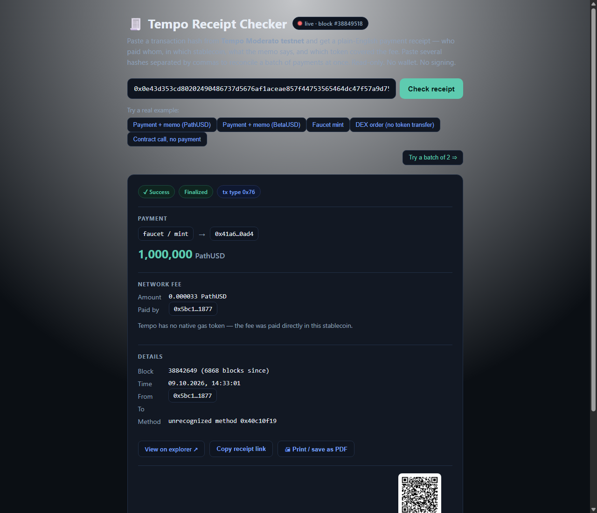 |
| 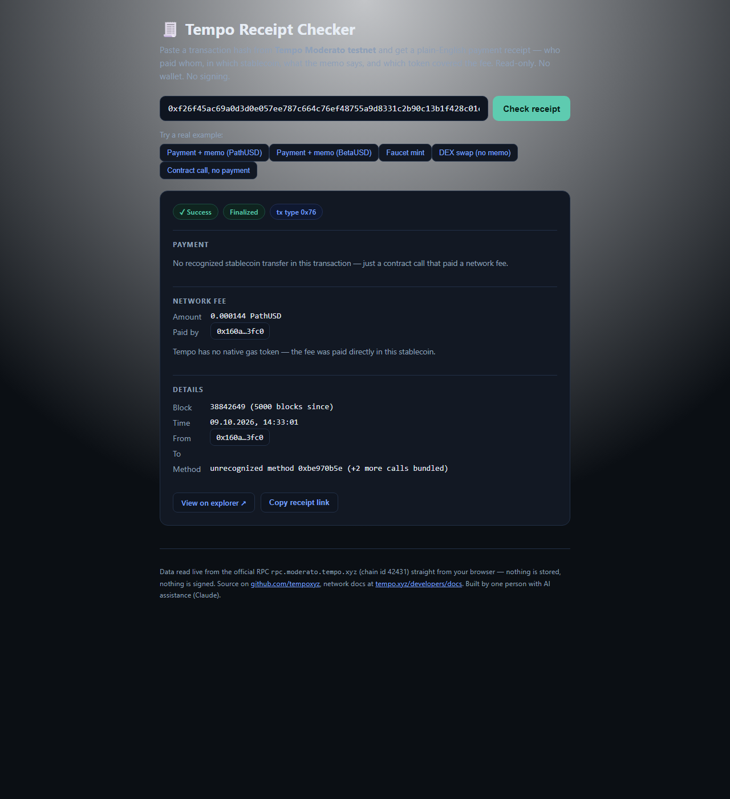 | 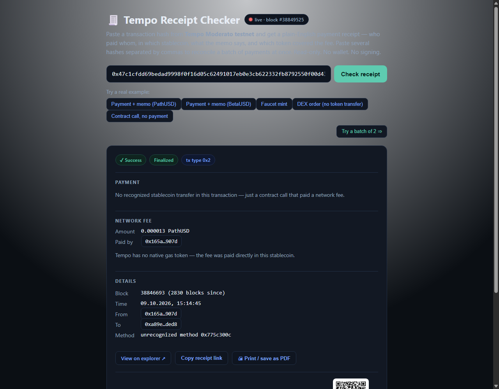 |
| 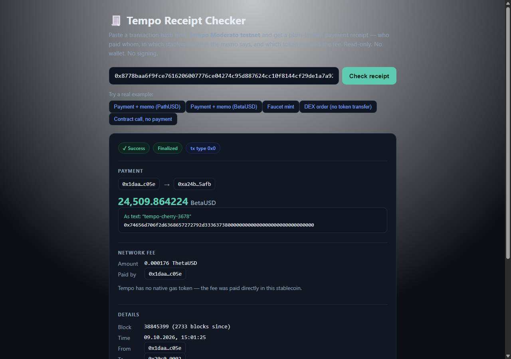 | 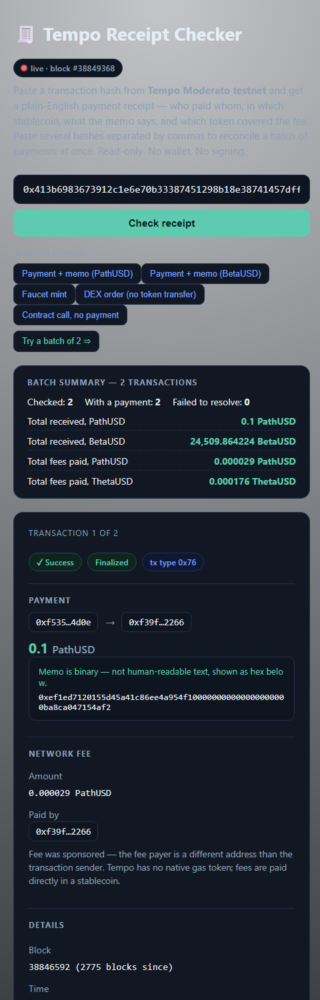 |
| 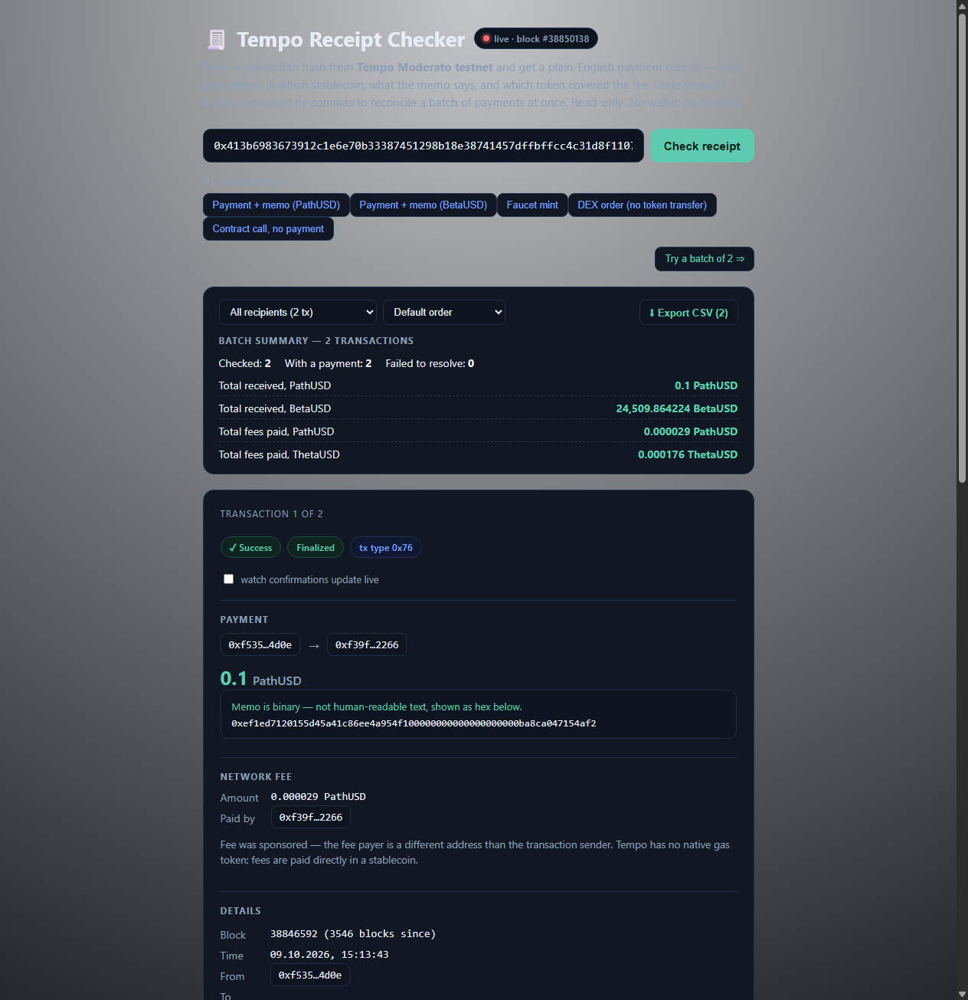 | 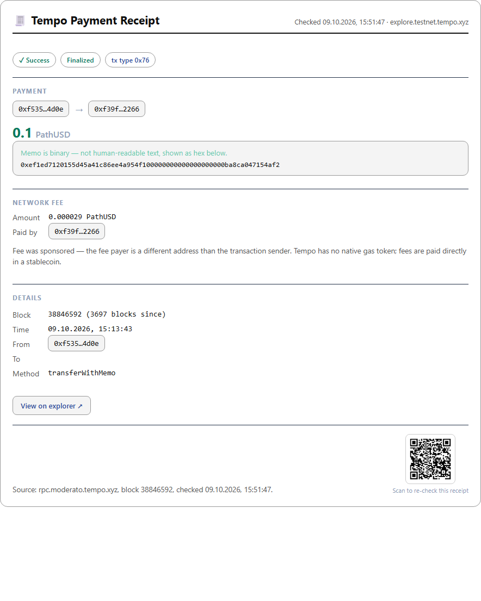 |
| 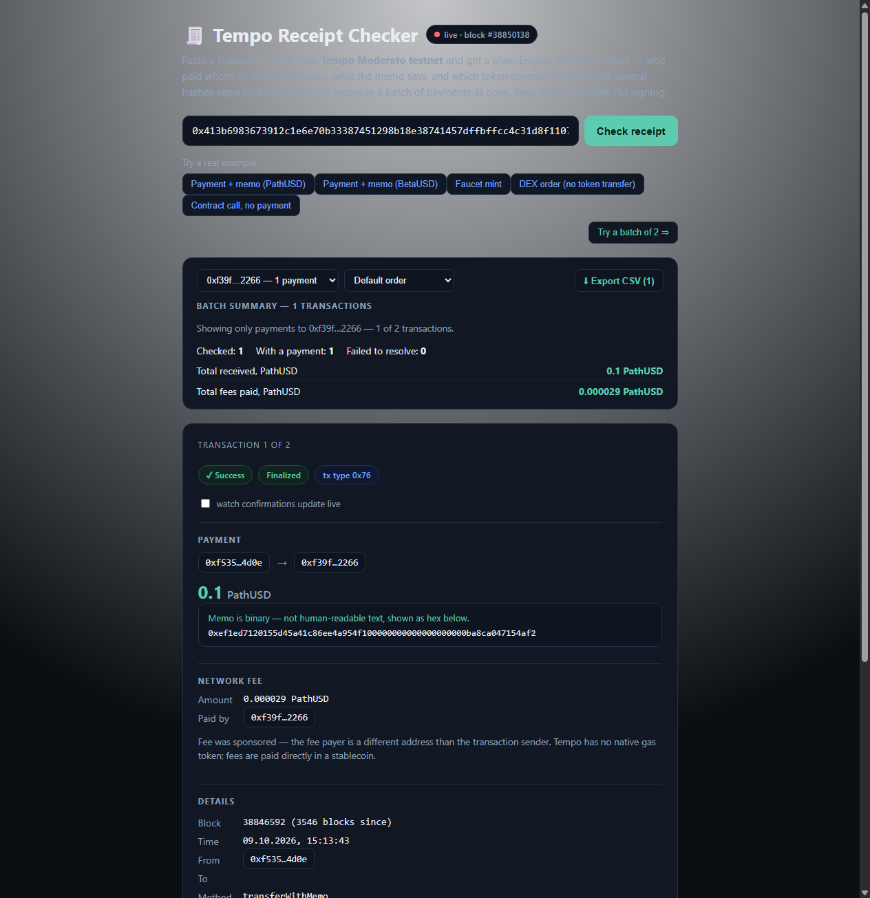 | 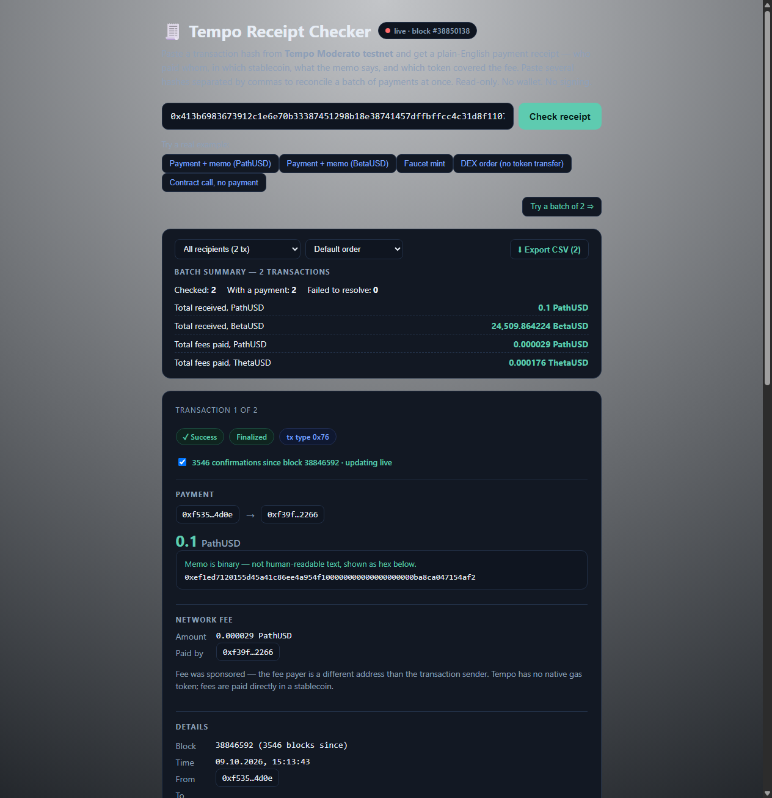 |
| 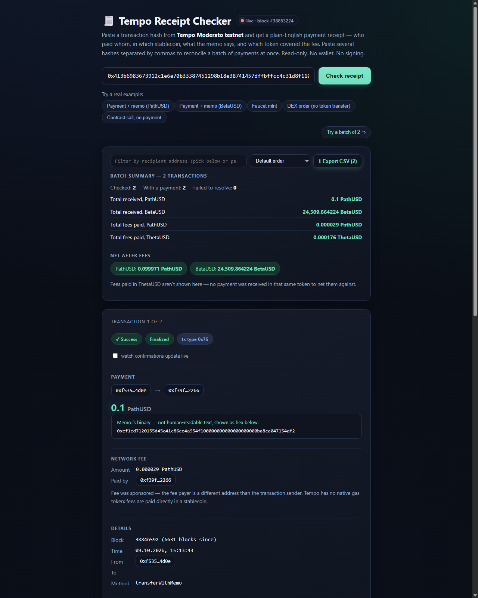 | 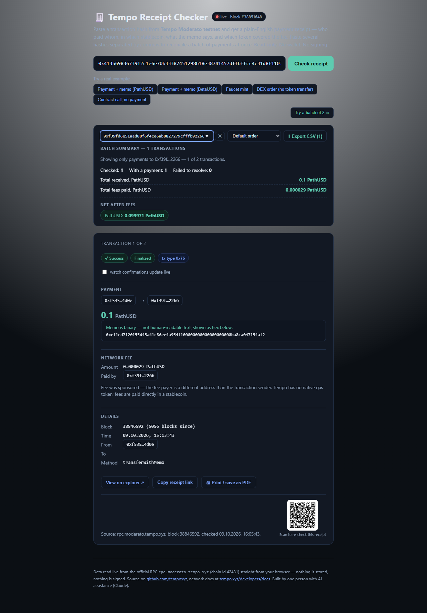 |
